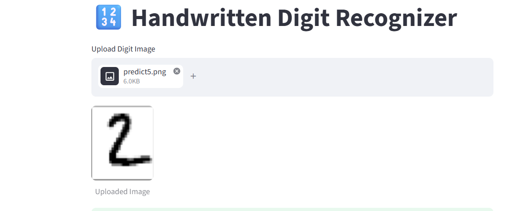
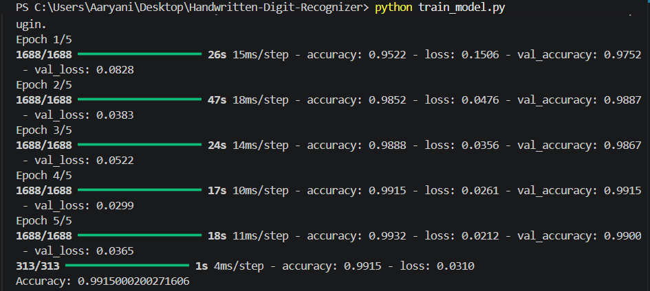
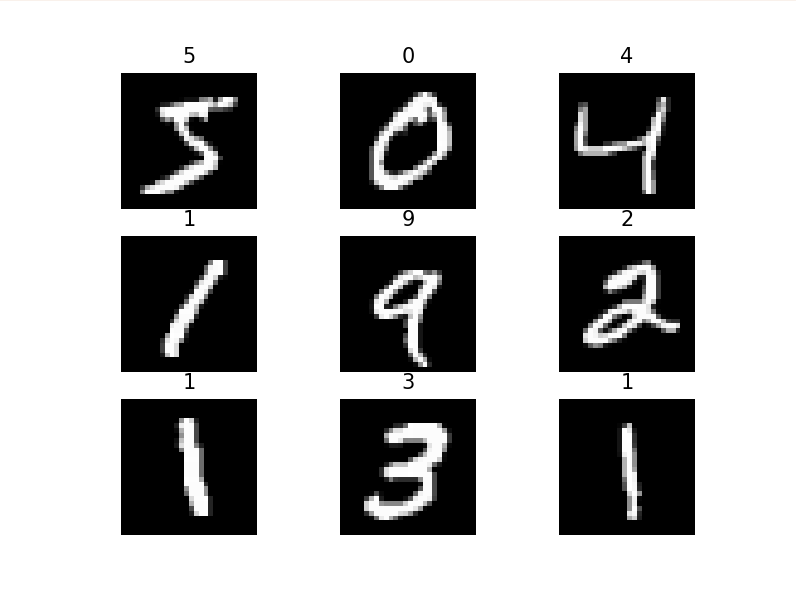

# 🔢 Handwritten Digit Recognizer Using CNN

## 📌 Project Overview

The Handwritten Digit Recognizer is a Deep Learning project that uses a Convolutional Neural Network (CNN) to identify handwritten digits from images.

The model is trained using the MNIST dataset, which contains thousands of handwritten digit images. Users can upload digit images through a Streamlit web application and receive instant predictions.

This project demonstrates the application of Computer Vision, Image Processing, and Deep Learning techniques.

---

## 🎯 Objectives

- Recognize handwritten digits accurately.
- Learn image preprocessing techniques.
- Understand Convolutional Neural Networks (CNNs).
- Train and evaluate a deep learning model.
- Deploy the model using Streamlit.

---

## 📂 Dataset Information

### Dataset Name

MNIST Dataset

### Dataset Description

The MNIST dataset contains grayscale handwritten digit images.

- Training Images: 60,000
- Testing Images: 10,000
- Image Size: 28 × 28 pixels
- Classes: 10 (Digits 0–9)

### Sample Classes

```text
0 1 2 3 4 5 6 7 8 9
```

---

## 🛠️ Technologies Used

- Python
- TensorFlow
- Keras
- NumPy
- Matplotlib
- Pillow
- Streamlit
- GitHub
- VS Code

---

## 🧠 Deep Learning Model

### Convolutional Neural Network (CNN)

Architecture:

```text
Input Layer (28x28x1)
        ↓
Conv2D (32 Filters)
        ↓
MaxPooling2D
        ↓
Conv2D (64 Filters)
        ↓
MaxPooling2D
        ↓
Conv2D (128 Filters)
        ↓
Flatten
        ↓
Dense (128)
        ↓
Dense (64)
        ↓
Output Layer (10 Classes)
```

---

## 🔄 Project Workflow

```text
MNIST Dataset
      ↓
Image Preprocessing
      ↓
CNN Model Creation
      ↓
Model Training
      ↓
Model Evaluation
      ↓
Model Saving
      ↓
Streamlit Deployment
```

---

## 📊 Model Performance

### Evaluation Metric

Accuracy

### Accuracy Achieved

**98% – 99%**

Replace this with your actual accuracy after training.

Example:

```text
Accuracy: 98.75%
```

---

## 📷 Screenshots

### Homepage


### Uploaded Digit



### Prediction Result


### Training Output



### Accuracy Result


### CNN Architecture


### MNIST Sample Images



---

## 📁 Project Structure

```text
Handwritten-Digit-Recognizer/
│
├── models/
│   └── digit_model.h5
│
├── screenshots/
│   ├── homepage.png
│   ├── uploaded_digit.png
│   ├── prediction_result.png
│   ├── training_output.png
│   ├── accuracy_result.png
│   ├── cnn_architecture.png
│   └── mnist_samples.png
│
├── train_model.py
├── predict_digit.py
├── app.py
├── requirements.txt
├── README.md
├── .gitignore
├── Project_Report.pdf
└── Presentation.pptx
```

---

## ⚙️ Installation

Clone Repository

```bash
git clone https://github.com/yourusername/Handwritten-Digit-Recognizer.git
```

Move to Project Folder

```bash
cd Handwritten-Digit-Recognizer
```

Install Dependencies

```bash
pip install -r requirements.txt
```

---

## 🚀 How to Run

### Train Model

```bash
python train_model.py
```

### Predict Using Image

```bash
python predict_digit.py
```

### Launch Streamlit App

```bash
streamlit run app.py
```

---

## 🎯 Example Prediction

### Input

Handwritten Digit Image:

```text
4
```

### Output

```text
Predicted Digit: 4
```

---

## 🌟 Future Enhancements

- Digit Drawing Canvas
- Real-Time Recognition
- Cloud Deployment
- Mobile Application
- Recognition of Alphabets
- Advanced CNN Architectures

---

## 👨‍💻 Author

**Name:** Your Name

**Internship:** Codec Technologies

**Domain:** Artificial Intelligence & Machine Learning

**GitHub:** https://github.com/yourusername

---

## 📜 License

This project is developed for educational and internship purposes.

---

⭐ If you found this project useful, consider starring the repository.
